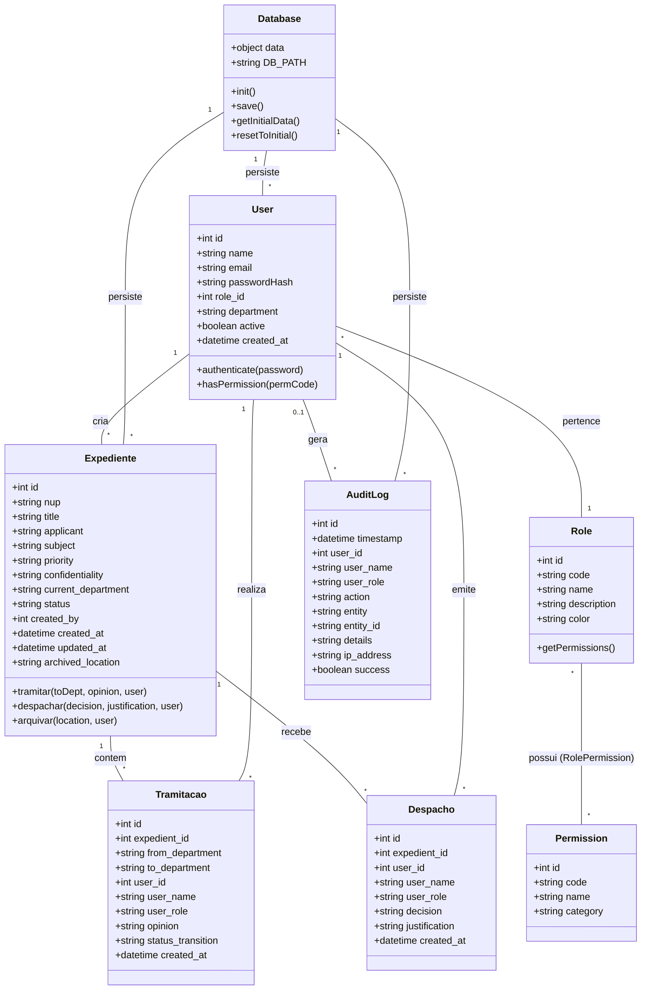
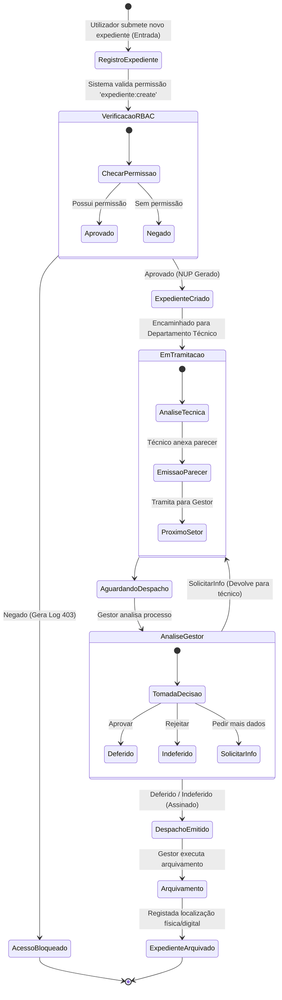
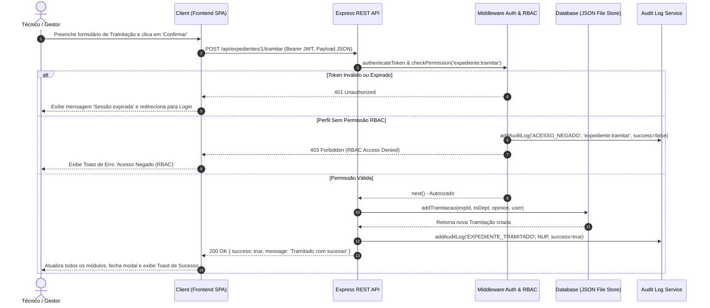
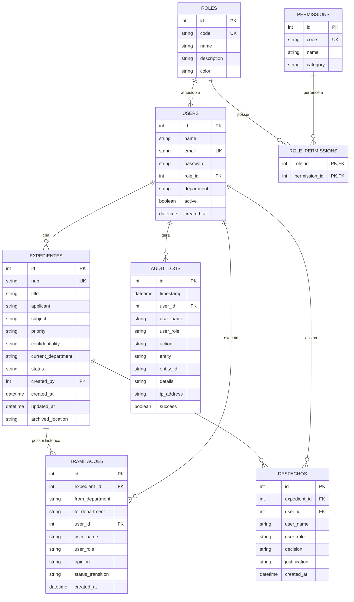

# DOCUMENTAÇÃO TÉCNICA E ACADÉMICA

## SISTEMA DE GESTÃO DE EXPEDIENTES COM CONTROLE DE ACESSO BASEADO EM PAPÉIS (SGE-RBAC)

---

**Disciplina**: Engenharia de Software  
**Curso**: Engenharia de Software / Informática  
**Ano Lectivo**: 2026  
**Integrantes do Grupo (Dupla)**:

1. **Abreu Martinho Pedro** (Desenvolvedor A — Frontend & UI | GitHub: [`AbreuPedro-Dev`](https://github.com/AbreuPedro-Dev))
2. **Paulo José Massingue Júnior** (Desenvolvedor B — Backend & API | GitHub: [`Paulo-Junior97`](https://github.com/Paulo-Junior97))  
**Link do Repositório GitHub**: [https://github.com/AbreuPedro-Dev/SGE-RBAC-Sistema-de-Gestao-de-Expedientes](https://github.com/AbreuPedro-Dev/SGE-RBAC-Sistema-de-Gestao-de-Expedientes)

---

## SUMÁRIO

1. [Introdução](#1-introdução)
   - [1.1 Contextualização](#11-contextualização)
   - [1.2 Objectivo Geral](#12-objectivo-geral)
   - [1.3 Objectivos Específicos](#13-objectivos-específicos)
2. [Metodologia de Desenvolvimento de Software](#2-metodologia-de-desenvolvimento-de-software)
   - [2.1 Metodologia Adoptada (Scrum / Agile)](#21-metodologia-adoptada-scrum--agile)
   - [2.2 Justificativa da Escolha da Metodologia](#22-justificativa-da-escolha-da-metodologia)
3. [Levantamento de Requisitos](#3-levantamento-de-requisitos)
   - [3.1 Requisitos Funcionais (RF)](#31-requisitos-funcionais-rf)
   - [3.2 Requisitos Não-Funcionais (RNF)](#32-requisitos-não-funcionais-rnf)
4. [Diagramas UML e Explicações](#4-diagramas-uml-e-explicações)
   - [4.1 Diagrama de Casos de Uso](#41-diagrama-de-casos-de-uso)
   - [4.2 Diagrama de Classes](#42-diagrama-de-classes)
   - [4.3 Diagrama de Actividade](#43-diagrama-de-actividade)
   - [4.4 Diagrama de Sequência](#44-diagrama-de-sequência)
5. [Modelo Entidade-Relacionamento (DER)](#5-modelo-entidade-relacionamento-der)
6. [Arquitectura e Componentes do Sistema](#6-arquitectura-e-componentes-do-sistema)
   - [6.1 Stack Tecnológico](#61-stack-tecnológico)
   - [6.2 Estrutura de Ficheiros](#62-estrutura-de-ficheiros)
   - [6.3 Mecanismo de Responsividade](#63-mecanismo-de-responsividade)
   - [6.4 Mecanismo de Restauro de Dados Demo](#64-mecanismo-de-restauro-de-dados-demo)
   - [6.5 Dataset de Demonstração](#65-dataset-de-demonstração)
7. [Histórico de Actualizações](#7-histórico-de-actualizações)
8. [Instruções para Submissão e Repositório GitHub](#8-instruções-para-submissão-e-repositório-github)

---

## 1. Introdução

### 1.1 Contextualização

Nas organizações modernas, a gestão eficiente e segura de documentos administrativos — conhecidos como **expedientes** — é crucial para garantir a transparência, celeridade processual e conformidade com as normas regulatórias. A tramitação de processos em suporte de papel envolve riscos significativos de extravio, desvio de prazos, acesso não autorizado e falta de auditabilidade.

O **Sistema de Gestão de Expedientes (SGE-RBAC)** surge como uma solução tecnológica avançada desenvolvida para automatizar o ciclo de vida completo de documentos e processos administrativos (desde a entrada e registo, passando pela tramitação entre departamentos, emissão de pareceres técnicos e despachos decisórios, até ao arquivamento definitivo). Para assegurar a integridade e confidencialidade da informação, o sistema foi desenhado com base no modelo **RBAC (Role-Based Access Control)**, associando permissões estritas a diferentes perfis de utilizadores.

### 1.2 Objectivo Geral

Desenvolver e implementar um **Sistema de Gestão de Expedientes web**, seguro, auditável e dotado de um mecanismo robusto de **Controle de Acesso Baseado em Papéis (RBAC)**, automatizando o ciclo de vida dos processos administrativos e garantindo a confidencialidade e rastreabilidade da informação.

### 1.3 Objectivos Específicos

1. Conceber um mecanismo de **Autenticação Segura** utilizando JSON Web Tokens (JWT) e encriptação de palavras-passe com `bcrypt`.
2. Implementar uma **Matriz de Permissões RBAC** flexível, definindo papéis para Administradores, Gestores, Técnicos e Consultores.
3. Automatizar a **Tramitação e Despacho de Expedientes**, atribuindo um Número Único de Processo (NUP) sequencial e registando o histórico encadeado de movimentações.
4. Desenvolver um **Módulo de Auditoria em Tempo Real** que registe de forma imutável todas as operações realizadas no sistema (Quem, O quê, Quando, IP).
5. Prover um **Dashboard de Indicadores** e funcionalidades de exportação de relatórios estatísticos e auditorias em formatos abertos (CSV).
6. Garantir uma **Interface Totalmente Responsiva** que se adapte a dispositivos móveis (375px), tablets (768px) e desktops (≥1024px).
7. Elaborar a **Documentação Técnica de Engenharia de Software**, incluindo especificações de requisitos, diagramas UML explicados e Modelo Entidade-Relacionamento (DER).

---

## 2. Metodologia de Desenvolvimento de Software

### 2.1 Metodologia Adoptada (Scrum / Agile)

Para o desenvolvimento deste projecto, adoptou-se o **Scrum**, uma das metodologias ágeis mais consolidadas na Engenharia de Software. O ciclo de desenvolvimento foi estruturado em **Sprints** iterativas de 1 semana, abrangendo as seguintes fases:

- **Sprint Planning**: Definição dos objetivos de cada sprint a partir do *Product Backlog*.
- **Execução & Pair Programming**: Trabalho colaborativo entre os dois elementos do grupo com revisão contínua de código (*code review*).
- **Sprint Review & Incremento**: Validação de incrementos funcionais testáveis (Auth -> RBAC -> Expedientes -> Auditoria -> Responsividade).
- **Sprint Retrospective**: Avaliação de melhorias no processo de desenvolvimento e refatoração de código.

### 2.2 Justificativa da Escolha da Metodologia

A escolha da metodologia **Scrum** fundamenta-se nos seguintes aspectos técnicos e práticos:

1. **Flexibilidade para Ajustes em Requisitos de Segurança**: Mecanismos de controle de acesso (RBAC) exigem validações frequentes. O Scrum permitiu testar e refinar a matriz de permissões iterativamente sem impactar a arquitetura global.
2. **Entrega Incremental de Valor**: A equipa pôde entregar uma versão funcional mínima (*MVP*) logo na primeira Sprint (Autenticação + Base de dados) e evoluir progressivamente para a gestão de expedientes, auditoria e optimização da interface.
3. **Mitigação de Riscos de Integração**: Sendo o projeto desenvolvido por uma dupla de estudantes, as reuniões diárias e revisões no GitHub garantiram alinhamento constante e evitaram conflitos de código (*merge conflicts*).
4. **Alinhamento com Boas Práticas Industriais**: A adoção do Scrum reflete os padrões reais do mercado de trabalho de desenvolvimento de software moderno.

---

## 3. Levantamento de Requisitos

### 3.1 Requisitos Funcionais (RF)

| Código | Descrição do Requisito Funcional | Prioridade |
| :--- | :--- | :--- |
| **RF01** | **Autenticação de Utilizadores**: O sistema deve permitir que os utilizadores iniciem sessão através do e-mail e palavra-passe encriptada. | Alta |
| **RF02** | **Gestão de Perfis e Permissões (RBAC)**: O sistema deve suportar papéis predefinidos (Admin, Gestor, Técnico, Leitor) e permitir a configuração dinâmica da matriz de permissões. | Alta |
| **RF03** | **Registo de Expedientes (Entrada)**: O sistema deve permitir a criação de expedientes com geração automática do NUP (ex: `EXP-2026-0001`). | Alta |
| **RF04** | **Classificação de Processos**: O sistema deve permitir atribuir prioridade (*Baixa, Média, Alta, Urgente*) e confidencialidade (*Público, Reservado, Confidencial*). | Média |
| **RF05** | **Tramitação / Encaminhamento**: O sistema deve permitir encaminhar expedientes entre departamentos com registo de parecer técnico. | Alta |
| **RF06** | **Emissão de Despachos Decisórios**: O gestor deve ser capaz de emitir despachos com status (*Deferido, Indeferido, Informação Adicional*) e fundamentação. | Alta |
| **RF07** | **Arquivamento de Expedientes**: O sistema deve permitir o arquivamento de processos concluídos registando a localização física/digital. | Média |
| **RF08** | **Restrição de Acesso Confidencial**: Expedientes confidenciais só podem ser visualizados por utilizadores autorizados (Admin, Gestor ou permissão `expediente:read_confidential`). | Alta |
| **RF09** | **Pesquisa e Filtros Avançados**: O sistema deve oferecer pesquisa por NUP, requerente, departamento, estado e prioridade. | Média |
| **RF10** | **Gestão de Utilizadores**: O administrador deve poder criar, editar, desativar utilizadores e redefinir palavras-passe. | Alta |
| **RF11** | **Logs de Auditoria Imutáveis**: O sistema deve registar automaticamente todas as operações de escrita, leitura restrita e falhas de acesso (Quem, O quê, Quando, IP). | Alta |
| **RF12** | **Dashboard Estatístico**: O sistema deve exibir gráficos visuais com total de expedientes, por estado, por prioridade e métricas de desempenho. | Média |
| **RF13** | **Exportação de Dados**: O sistema deve permitir a exportação dos logs de auditoria em formato CSV. | Média |
| **RF14** | **Alternância de Tema (Dark/Light Mode)**: O sistema deve permitir alternar a interface visual entre tema claro e escuro. | Baixa |
| **RF15** | **Seleção Rápida Demo**: A tela de login deve disponibilizar botões de preenchimento rápido para teste imediato de todos os perfis. | Baixa |
| **RF16** | **Restauro de Dados Demo**: O sistema deve permitir ao Administrador restaurar a base de dados ao estado inicial de demonstração, com recarga imediata de todos os módulos. | Média |
| **RF17** | **Interface Responsiva Multi-dispositivo**: A interface deve adaptar-se correctamente a dispositivos móveis (≤640px), tablets (≤768px e ≤992px) e desktops (≥993px). | Alta |

### 3.2 Requisitos Não-Funcionais (RNF)

| Código | Descrição do Requisito Não-Funcional | Categoria |
| :--- | :--- | :--- |
| **RNF01** | **Segurança da Informação**: Utilização de JWT assinado com chave secreta e encriptação de senhas com algoritmo `bcrypt` (10 salt rounds). | Segurança |
| **RNF02** | **Desempenho**: As requisições à API devem ter um tempo de resposta inferior a 200 milissegundos em condições normais de carga. | Desempenho |
| **RNF03** | **Usabilidade e Design Responsivo**: Interface web desenvolvida com componentes Glassmorphism, adaptável a dispositivos desktop, tablets e mobile com 3 breakpoints CSS distintos. | Usabilidade |
| **RNF04** | **Rastreabilidade e Não-Repúdio**: Todos os registos de auditoria devem ser imutáveis e armazenar o endereço IP e carimbo de data/hora (ISO 8601). | Auditoria |
| **RNF05** | **Portabilidade**: A aplicação deve executar em qualquer sistema operativo que suporte Node.js (Windows, Linux, macOS). | Portabilidade |
| **RNF06** | **Arquitectura Modular**: Separação clara entre backend (Express REST API), persistência (DB Layer) e frontend (SPA Decoupled). | Manutenibilidade |
| **RNF07** | **Princípio do Menor Privilégio (PoLP)**: Utilizadores sem a permissão explícita devem ter o acesso bloqueado tanto na interface quanto nas rotas HTTP. | Segurança |
| **RNF08** | **Integridade Referencial**: O banco de dados deve garantir a consistência das relações entre expedientes, tramitações e utilizadores. | Confiabilidade |
| **RNF09** | **Independência de Dependências Externas**: O frontend deve ser capaz de ser executado autonomamente sem dependência obrigatória de compiladores complexos. | Operacional |
| **RNF10** | **Conformidade com Padrões REST**: As APIs devem utilizar métodos HTTP corretos (GET, POST, PUT, DELETE) e códigos de estado apropriados (200, 400, 401, 403, 404, 500). | Arquitectura |
| **RNF11** | **Consistência do Estado da UI**: Após operações de escrita (restauro, tramitação, etc.), todos os módulos visíveis devem reflectir os novos dados sem necessidade de recarga manual da página. | Usabilidade |

---

## 4. Diagramas UML e Explicações

### 4.1 Diagrama de Casos de Uso

O Diagrama de Casos de Uso ilustra as interações entre os atores principais do sistema e os módulos de funcionalidade.

```mermaid
usecaseDiagram
  actor "Administrador" as Admin
  actor "Chefe de Secretaria / Gestor" as Gestor
  actor "Técnico Tramitador" as Tecnico
  actor "Consultor / Leitor" as Leitor

  package "Sistema de Gestão de Expedientes (SGE-RBAC)" {
    usecase "Autenticar no Sistema" as UC_Auth
    usecase "Gerir Utilizadores" as UC_Users
    usecase "Configurar Matriz RBAC" as UC_RBAC
    usecase "Restaurar Dados Demo" as UC_Reset
    usecase "Consultar Logs de Auditoria" as UC_Audit
    usecase "Registar Expediente" as UC_RegExp
    usecase "Consultar Expedientes Públicos" as UC_ReadPublic
    usecase "Consultar Expedientes Confidenciais" as UC_ReadConf
    usecase "Tramitar Expediente / Emitir Parecer" as UC_Tramitar
    usecase "Emitir Despacho Decisório" as UC_Despachar
    usecase "Arquivar Expediente" as UC_Arquivar
    usecase "Exportar Relatórios CSV" as UC_Export
  }

  Leitor --> UC_Auth
  Leitor --> UC_ReadPublic

  Tecnico --> UC_Auth
  Tecnico --> UC_ReadPublic
  Tecnico --> UC_RegExp
  Tecnico --> UC_Tramitar

  Gestor --> UC_Auth
  Gestor --> UC_ReadPublic
  Gestor --> UC_ReadConf
  Gestor --> UC_RegExp
  Gestor --> UC_Tramitar
  Gestor --> UC_Despachar
  Gestor --> UC_Arquivar
  Gestor --> UC_Audit
  Gestor --> UC_Export

  Admin --> UC_Auth
  Admin --> UC_Users
  Admin --> UC_RBAC
  Admin --> UC_Reset
  Admin --> UC_Audit
  Admin --> UC_Export
  Admin --> UC_ReadPublic
  Admin --> UC_ReadConf
  Admin --> UC_Despachar
  Admin --> UC_Arquivar
```

#### Explicação dos Casos de Uso

- **Consultor / Leitor**: Pode autenticar-se e visualizar expedientes de acesso público.
- **Técnico Tramitador**: Adiciona a capacidade de registar novos expedientes e realizar tramitações entre setores emitindo pareceres técnicos.
- **Chefe de Secretaria / Gestor**: Detém permissões para emitir despachos decisórios (*Deferido/Indeferido*), visualizar processos confidenciais, arquivar expedientes concluídos e consultar a auditoria.
- **Administrador do Sistema**: Possui supervisão total sobre a gestão de contas de utilizadores, configuração da matriz de permissões RBAC, auditoria do sistema e restauro dos dados de demonstração.

---

### 4.2 Diagrama de Classes

O Diagrama de Classes apresenta a estrutura estática do domínio do sistema, os seus atributos, métodos e associações.



#### Explicação das Relações entre Classes

- **User - Role**: Associação N:1 (Vários utilizadores possuem um perfil RBAC).
- **Role - Permission**: Associação N:M intermediada por `RolePermission` (Matriz RBAC).
- **Expediente - Tramitacao / Despacho**: Composição 1:N (Um expediente possui um histórico ordenado de tramitações e despachos).
- **User - AuditLog**: Associação 1:N registando a responsabilidade de cada ação efetuada no sistema.
- **Database**: Singleton que encapsula a persistência em `database.json` e expõe `getInitialData()` para restauro de dados demo.

---

### 4.3 Diagrama de Actividade

O Diagrama de Actividade descreve o fluxo de trabalho (*workflow*) do ciclo de vida de um expediente desde a entrada até ao arquivamento.



---

### 4.4 Diagrama de Sequência

O Diagrama de Sequência detalha o fluxo de mensagens entre o Frontend (SPA), Servidor Express, Middleware RBAC e Banco de Dados durante a tramitação de um expediente.



---

## 5. Modelo Entidade-Relacionamento (DER)

O Modelo Entidade-Relacionamento (DER) descreve o esquema conceitual e lógico da base de dados relacional.



---

## 6. Arquitectura e Componentes do Sistema

### 6.1 Stack Tecnológico

| Camada | Tecnologia | Versão | Função |
| :--- | :--- | :--- | :--- |
| **Backend** | Node.js + Express.js | ≥18 LTS | API REST, autenticação, middleware RBAC |
| **Autenticação** | JSON Web Token (JWT) | 9.x | Sessões stateless com expiração |
| **Segurança** | bcrypt | 5.x | Hash de palavras-passe (10 salt rounds) |
| **Persistência** | JSON File Store (`database.json`) | — | Base de dados leve, sem servidor adicional |
| **Frontend** | HTML5 + CSS3 Vanilla + JavaScript ES6+ | — | SPA (Single Page Application) sem framework |
| **Gráficos** | Chart.js | CDN | Dashboard com gráficos de barras e donut |
| **Iconografia** | Remixicon | 4.2.0 | Ícones vectoriais consistentes |
| **Tipografia** | Google Fonts (Inter + Outfit) | — | Tipografia moderna e legível |

### 6.2 Estrutura de Ficheiros

```text
SGE-RBAC/
├── server.js                  # Servidor Express: rotas REST e middleware
├── package.json               # Dependências e scripts npm
├── data/
│   └── database.json          # Base de dados persistida em JSON
├── src/
│   └── database/
│       └── db.js              # Classe Database: CRUD, seed e restauro
└── public/                    # Assets estáticos servidos pelo Express
    ├── index.html             # SPA: única página HTML com todos os módulos
    ├── css/
    │   └── style.css          # Sistema de design, tokens CSS e responsividade
    └── js/
        └── app.js             # Lógica do cliente: estado, routing e chamadas API
```

### 6.3 Mecanismo de Responsividade

A interface do sistema foi desenvolvida com uma estratégia **Mobile-First** progressiva, implementada inteiramente em CSS Vanilla com três breakpoints distintos:

#### Breakpoints e Comportamento

| Breakpoint | Largura | Dispositivo Alvo | Alterações Principais |
| :--- | :--- | :--- | :--- |
| **Desktop** | `> 992px` | Monitor / Laptop | Layout completo: sidebar fixa, KPI 4 colunas, gráficos 2fr+1fr |
| **Tablet Landscape** | `≤ 992px` | iPad horizontal | Sidebar colapsa para drawer deslizante, KPI 2 colunas, gráficos empilhados |
| **Tablet Portrait** | `≤ 768px` | iPad vertical | Topbar compacto, subtítulo oculto, botões ícone-only, filtros em coluna, formulários 1 coluna |
| **Mobile** | `≤ 640px` | Smartphone | KPI 1 coluna, modais em bottom-sheet, botões empilhados, banner em coluna |

#### Classes CSS Utilitárias

Para garantir que os media queries possam sobrepor os estilos, foram criadas classes CSS reutilizáveis em substituição de estilos `inline`:

| Classe | Comportamento Desktop | Comportamento Mobile (≤768px) |
| :--- | :--- | :--- |
| `.chart-grid` | `grid-template-columns: 2fr 1fr` | `grid-template-columns: 1fr` |
| `.grid-2col` | `grid-template-columns: 1fr 1fr` | `grid-template-columns: 1fr` |
| `.kpi-grid` | `repeat(4, 1fr)` | `repeat(2, 1fr)` → `1fr` em mobile |

#### Comportamento dos Modais em Mobile

Em dispositivos com largura ≤ 640px, os modais adoptam o padrão **Bottom Sheet** (folha deslizante de baixo para cima):

- Alinham-se ao fundo do ecrã (`align-items: flex-end`)
- Bordas superiores arredondadas, base plana
- Altura máxima de 95vh com scroll interno
- Botões de acção empilhados verticalmente e com largura total

#### Sidebar Drawer (Mobile)

Em viewports ≤ 992px, a sidebar:

1. Posiciona-se como `position: fixed` fora do ecrã (`transform: translateX(-100%)`)
2. Um botão hambúrguer (`.btn-mobile-toggle`) é exibido na topbar
3. Ao clicar, a classe `.mobile-active` é adicionada via JavaScript, deslizando a sidebar para dentro
4. Um overlay escuro semi-transparente (`.sidebar-overlay`) cobre o conteúdo e fecha a sidebar ao clicar

### 6.4 Mecanismo de Restauro de Dados Demo

O sistema implementa um fluxo completo de restauro de dados demonstrativos, acessível exclusivamente ao perfil **Administrador**.

#### Fluxo de Restauro

```text
Admin clica "Restaurar Dados Demo"
        │
        ▼
Confirmação via window.confirm()
        │
        ├── Cancelado → Nenhuma acção
        │
        └── Confirmado
                │
                ▼
        POST /api/reset-demo  (JWT Bearer)
                │
                ▼
        Servidor: db.resetToInitial()
        ├── Apaga todos os dados actuais
        ├── Carrega getInitialData() com bcrypt
        └── Persiste em database.json
                │
                ▼
        200 OK → Cliente: reloadAllModules()
        ├── loadDashboard()
        ├── loadExpedientes()
        ├── loadUsers()
        ├── loadRBAC()
        └── loadAuditLogs()
                │
                ▼
        Toast "Dados restaurados com sucesso"
```

#### Banner de Restauro

O banner azul "Restaurar Dados Demo" é exibido permanentemente na dashboard para utilizadores com perfil Admin. O banner é controlled pela função `renderRestoreBanner()` no `app.js`, que verifica se `currentUser.role === 'admin'` independentemente da quantidade de expedientes existentes.

#### Função `reloadAllModules()`

Após o restauro bem-sucedido, todos os módulos activos são actualizados sem necessidade de recarregar a página:

```javascript
async function reloadAllModules() {
  await loadDashboard();      // KPIs e gráficos
  await loadExpedientes();    // Tabela de processos
  await loadUsers();          // Gestão de utilizadores
  await loadRBAC();           // Matriz de permissões
  await loadAuditLogs();      // Histórico de auditoria
}
```

### 6.5 Dataset de Demonstração

O sistema inclui um conjunto de dados pré-carregados que simula 6 dias de actividade organizacional real, com datas entre **13 e 18 de Agosto de 2026**.

#### Utilizadores Demo

| ID | Nome | Perfil | Departamento | Data de Criação |
| :--- | :--- | :--- | :--- | :--- |
| 1 | Eng. Amilcar Silva | Administrador | Tecnologias de Informação | 13 Ago 08:00 |
| 2 | Dra. Maria Abreu | Gestora | Secretaria-Geral | 13 Ago 09:30 |
| 3 | Dr. Pedro Macamo | Técnico | Departamento Jurídico | 13 Ago 10:15 |
| 4 | Sr. Tomas Sitoe | Leitor | Atendimento ao Público | 13 Ago 11:00 |

#### Expedientes Demo

| NUP | Estado | Prioridade | Criado em | Última Actualização |
| :--- | :--- | :--- | :--- | :--- |
| EXP-2026-0004 | Arquivado | Alta | 13 Ago 08:30 | 14 Ago 17:00 |
| EXP-2026-0002 | Deferido | Média | 13 Ago 10:00 | 15 Ago 16:00 |
| EXP-2026-0001 | Em Tramitação | Alta | 16 Ago 09:00 | 17 Ago 14:30 |
| EXP-2026-0003 | Em Tramitação | Urgente/Confidencial | 17 Ago 11:20 | 18 Ago 08:45 |

#### Cronologia dos Logs de Auditoria Demo (12 entradas)

| Data/Hora | Acção | Entidade |
| :--- | :--- | :--- |
| 13 Ago 08:00 | `SISTEMA_INICIALIZADO` | Sistema |
| 13 Ago 08:15 | `LOGIN_SUCESSO` | Autenticação |
| 13 Ago 09:30 | `UTILIZADOR_CRIADO` | Utilizador #2 |
| 13 Ago 10:00 | `EXPEDIENTE_CRIADO` | EXP-2026-0002 |
| 14 Ago 11:00 | `TRAMITACAO_EMITIDA` | EXP-2026-0002 |
| 14 Ago 17:00 | `EXPEDIENTE_ARQUIVADO` | EXP-2026-0004 |
| 15 Ago 09:15 | `TRAMITACAO_EMITIDA` | EXP-2026-0002 |
| 15 Ago 16:00 | `DESPACHO_EMITIDO` | EXP-2026-0002 |
| 16 Ago 09:00 | `EXPEDIENTE_CRIADO` | EXP-2026-0001 |
| 17 Ago 11:20 | `EXPEDIENTE_CRIADO` | EXP-2026-0003 |
| 17 Ago 14:30 | `TRAMITACAO_EMITIDA` | EXP-2026-0001 |
| 18 Ago 08:10 | `MATRIZ_RBAC_ATUALIZADA` | Permissão |

---

## 7. Histórico de Actualizações

| Versão | Data | Descrição das Alterações |
| :--- | :--- | :--- |
| **v1.0** | Jan 2026 | Versão inicial: autenticação JWT, RBAC, expedientes, auditoria |
| **v1.1** | Ago 2026 | Restauro de dados: `resetDemoData()` com `reloadAllModules()` para sincronização de todos os módulos |
| **v1.2** | Ago 2026 | Banner de restauro sempre visível para Admin; removida a condição de dependência do total de expedientes |
| **v1.3** | Ago 2026 | **Responsividade completa**: 3 breakpoints (992px, 768px, 640px), sidebar drawer, modais bottom-sheet, classes `.chart-grid` e `.grid-2col` |
| **v1.4** | Ago 2026 | Dataset demo actualizado: datas movidas de Jan–Fev 2026 para **13–18 Ago 2026**; actualização simultânea de `db.js` e `database.json` |

---

## 8. Instruções para Submissão e Repositório GitHub

### 8.1 Instalação e Execução Local

```bash
# 1. Clonar o repositório
git clone git@github.com:AbreuPedro-Dev/SGE-RBAC-Sistema-de-Gestao-de-Expedientes.git

# 2. Instalar dependências
npm install

# 3. Iniciar o servidor
npm start

# 4. Aceder à aplicação
# http://localhost:3000
```

### 8.2 Credenciais de Demonstração

| Perfil | E-mail | Palavra-passe |
| :--- | :--- | :--- |
| Administrador | `admin@sge.gov.mz` | `Admin123!` |
| Gestor | `gestor@sge.gov.mz` | `Gestor123!` |
| Técnico | `tecnico@sge.gov.mz` | `Tecnico123!` |
| Leitor | `leitor@sge.gov.mz` | `Leitor123!` |

### 8.3 Como Restaurar os Dados Demo

1. Iniciar sessão como **Administrador** (`admin@sge.gov.mz`)
2. No **Dashboard**, clicar no botão azul **"Restaurar Dados Demo"**
3. Confirmar a operação no diálogo de confirmação
4. Todos os módulos são actualizados automaticamente

### 8.4 Link do Repositório GitHub

O código-fonte completo do projecto, acompanhado das suas instruções de configuração e este relatório de documentação técnica, encontra-se disponível publicamente no seguinte repositório:

👉 **[https://github.com/AbreuPedro-Dev/SGE-RBAC-Sistema-de-Gestao-de-Expedientes](https://github.com/AbreuPedro-Dev/SGE-RBAC-Sistema-de-Gestao-de-Expedientes)**

### 8.5 Verificação de Contribuições (Commits por Integrante)

Em cumprimento dos requisitos de entrega:

- O trabalho foi desenvolvido em grupo de **2 estudantes**.
- Cada elemento do grupo realizou a submissão individual do relatório na sala virtual.
- O histórico de *commits* do repositório público no GitHub comprova a participação ativa e equilibrada de ambos os integrantes da dupla na implementação do código-fonte e na elaboração da documentação técnica.

---
*Documentação elaborada e submetida em conformidade com as diretrizes da disciplina de Engenharia de Software (2026). Versão actual: **v1.4** — Agosto de 2026.*
