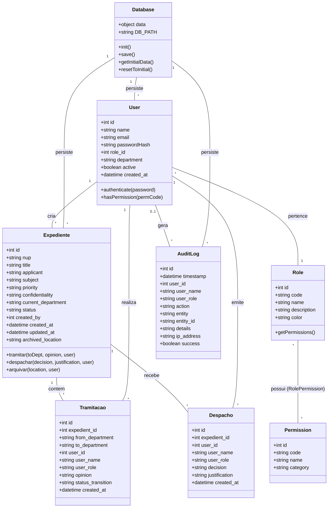
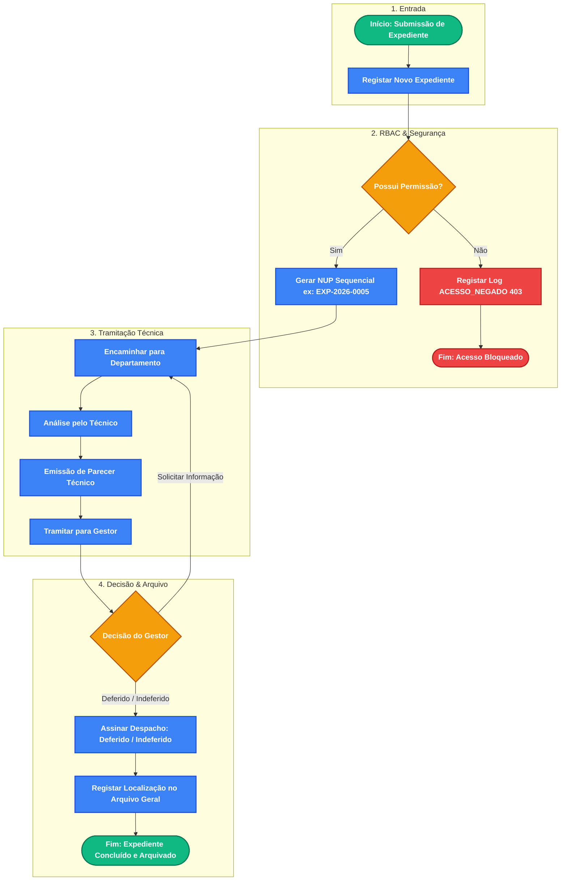
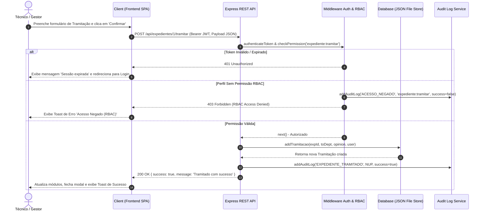
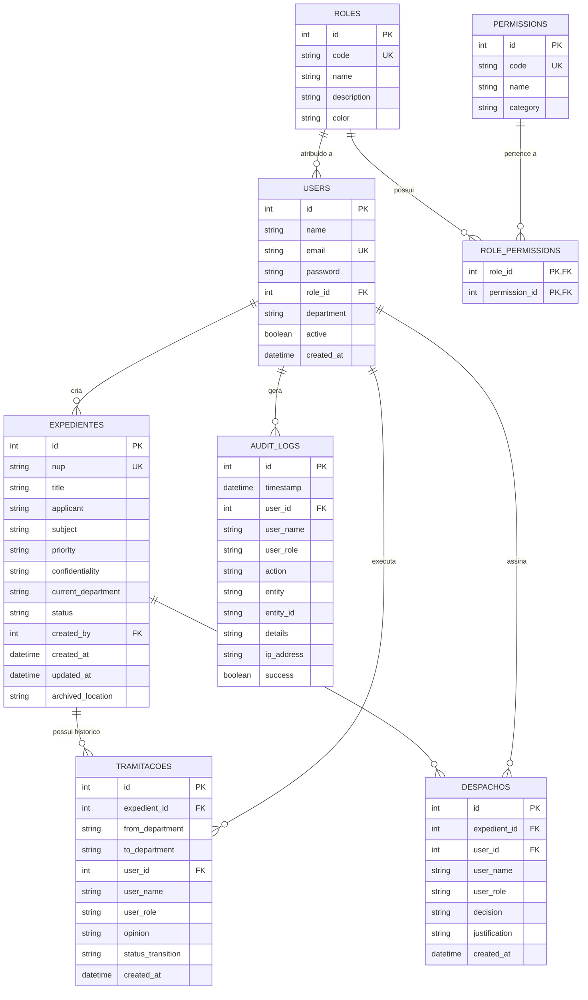

# DOCUMENTAÇÃO TÉCNICA E ACADÉMICA

## SISTEMA DE GESTÃO DE EXPEDIENTES COM CONTROLE DE ACESSO BASEADO EM PAPÉIS (SGE-RBAC)

---

**Disciplina**: Engenharia de Software  
**Curso**: Engenharia de Software / Informática  
**Ano Lectivo**: 2026  
**Integrantes do Grupo (Dupla)**:  
1. **Abreu Martinho Pedro** (Desenvolvedor A — Frontend & UI | GitHub: [`AbreuPedro-Dev`](https://github.com/AbreuPedro-Dev))  
2. **Paulo José Massingue Júnior** (Desenvolvedor B — Backend & API | GitHub: [`Paulo-Junior97`](https://github.com/Paulo-Junior97))  
**Link do Repositório GitHub**: [https://github.com/AbreuPedro-Dev/SGE-RBAC-Sistema-de-Gestao-de-Expedientes](https://github.com/AbreuPedro-Dev/SGE-RBAC-Sistema-de-Gestao-de-Expedientes)

---

## 1. Introdução

### 1.1 Contextualização
Nas organizações modernas, a gestão eficiente e segura de documentos administrativos — os **expedientes** — é crucial para a transparência, celeridade processual e conformidade regulatória. A tramitação em suporte de papel envolve riscos de extravio, desvio de prazos, acesso não autorizado e falta de auditabilidade. O **Sistema de Gestão de Expedientes (SGE-RBAC)** automatiza o ciclo de vida completo de documentos (registo, tramitação, pareceres, despachos e arquivamento) sob o modelo **RBAC (Role-Based Access Control)**, garantindo integridade e confidencialidade.

### 1.2 Objectivo Geral
Desenvolver e implementar um **Sistema de Gestão de Expedientes web**, seguro, auditável e dotado de um mecanismo de **Controle de Acesso Baseado em Papéis (RBAC)**, automatizando a gestão de processos administrativos com total rastreabilidade.

### 1.3 Objectivos Específicos
1. Implementar **Autenticação Segura** via JSON Web Tokens (JWT) e encriptação com `bcrypt`.
2. Estruturar uma **Matriz de Permissões RBAC** flexível para Administradores, Gestores, Técnicos e Consultores.
3. Automatizar a **Tramitação e Despacho**, com geração de Número Único de Processo (NUP) sequencial e histórico imutável.
4. Desenvolver um **Módulo de Auditoria em Tempo Real** para registo detalhado das operações (Quem, O quê, Quando, IP).
5. Prover **Dashboard de Indicadores** com exportação de relatórios estatísticos e auditoria em CSV.
6. Assegurar **Interface Responsiva Multi-dispositivo** (mobile 375px, tablet 768px, desktop ≥1024px).
7. Elaborar a **Documentação Técnica** com especificação de requisitos, diagramas UML explicados e DER.

---

## 2. Metodologia de Desenvolvimento de Software

### 2.1 Metodologia Adoptada (Scrum / Agile)
Adoptou-se a metodologia **Scrum** com Sprints semanais contemplando: **Sprint Planning** (definição do backlog), **Execução & Pair Programming** (desenvolvimento colaborativo com *code review*), **Sprint Review** (validação dos incrementos funcionais) e **Sprint Retrospective** (melhoria contínua de processos).

### 2.2 Justificativa da Escolha da Metodologia
1. **Flexibilidade no Ajuste de Segurança**: Validação e ajuste iterativo da matriz de permissões RBAC sem comprometer a arquitectura.
2. **Entrega Incremental de Valor**: Disponibilização rápida do MVP (Auth + DB) e evolução gradual para expedientes, auditoria e responsividade.
3. **Mitigação de Riscos de Integração**: Alinhamento constante da dupla de desenvolvedores prevenindo conflitos no Git/GitHub.
4. **Padrões de Mercado**: Adoção de práticas reais da indústria de desenvolvimento de software.

---

## 3. Levantamento de Requisitos

### 3.1 Requisitos Funcionais (RF)

| Código | Descrição do Requisito Funcional | Prioridade |
| :--- | :--- | :--- |
| **RF01** | **Autenticação de Utilizadores**: Início de sessão via e-mail e palavra-passe encriptada (`bcrypt`). | Alta |
| **RF02** | **Gestão de Perfis e Permissões (RBAC)**: Suporte a papéis (Admin, Gestor, Técnico, Leitor) e matriz dinâmica de permissões. | Alta |
| **RF03** | **Registo de Expedientes**: Criação de processos com geração automática do NUP sequencial (ex: `EXP-2026-0001`). | Alta |
| **RF04** | **Classificação de Processos**: Definição de prioridade (*Baixa, Média, Alta, Urgente*) e confidencialidade (*Público, Reservado, Confidencial*). | Média |
| **RF05** | **Tramitação / Encaminhamento**: Encaminhamento entre departamentos com registo obrigatório de parecer técnico. | Alta |
| **RF06** | **Emissão de Despachos**: Decisão do gestor (*Deferido, Indeferido, Informação Adicional*) devidamente fundamentada. | Alta |
| **RF07** | **Arquivamento de Expedientes**: Registo do arquivamento físico/digital de processos concluídos. | Média |
| **RF08** | **Restrição de Acesso Confidencial**: Expedientes confidenciais restritos a perfis autorizados (Admin, Gestor ou leitor autorizado). | Alta |
| **RF09** | **Pesquisa e Filtros**: Busca por NUP, requerente, departamento, estado e prioridade. | Média |
| **RF10** | **Gestão de Utilizadores**: CRUD de utilizadores e redefinição de credenciais por administradores. | Alta |
| **RF11** | **Logs de Auditoria Imutáveis**: Registo de escritas, acessos restritos e falhas (Quem, O quê, Quando, IP). | Alta |
| **RF12** | **Dashboard Estatístico**: Exibição de gráficos e métricas de desempenho dos expedientes. | Média |
| **RF13** | **Exportação de Dados**: Download dos logs de auditoria em formato CSV. | Média |
| **RF14** | **Alternância de Tema**: Suporte a temas claro (Light) e escuro (Dark). | Baixa |
| **RF15** | **Seleção Rápida Demo**: Botões de login automático para perfis de teste na tela inicial. | Baixa |
| **RF16** | **Restauro de Dados Demo**: Reposição da base de dados ao estado inicial com sincronização de todos os módulos. | Média |
| **RF17** | **Interface Responsiva**: Adaptação perfeita a mobile (≤640px), tablet (≤768px/992px) e desktop (≥993px). | Alta |

### 3.2 Requisitos Não-Funcionais (RNF)

| Código | Descrição do Requisito Não-Funcional | Categoria |
| :--- | :--- | :--- |
| **RNF01** | **Segurança**: JWT assinado e palavras-passe armazenadas com `bcrypt` (10 salt rounds). | Segurança |
| **RNF02** | **Desempenho**: Tempo de resposta da API REST inferior a 200ms em condições normais. | Desempenho |
| **RNF03** | **Usabilidade e Responsividade**: Interface moderna (Glassmorphism) adaptável em 3 breakpoints CSS. | Usabilidade |
| **RNF04** | **Rastreabilidade**: Logs imutáveis com registo de IP e timestamp ISO 8601. | Auditoria |
| **RNF05** | **Portabilidade**: Execução em qualquer ambiente Node.js (Windows, Linux, macOS). | Portabilidade |
| **RNF06** | **Arquitectura Modular**: Separação clara entre backend REST API, camada de dados e frontend SPA. | Manutenibilidade |
| **RNF07** | **Princípio do Menor Privilégio (PoLP)**: Bloqueio estrito de funcionalidades não autorizadas na API e UI. | Segurança |
| **RNF08** | **Integridade Referencial**: Garantia de consistência entre expedientes, tramitações e utilizadores. | Confiabilidade |
| **RNF09** | **Autonomia Frontend**: SPA executável sem dependência de ferramentas de compilação complexas. | Operacional |
| **RNF10** | **Padrão RESTful**: Uso correcto de métodos HTTP (GET, POST, PUT, DELETE) e status codes (200, 401, 403, 404, 500). | Arquitectura |
| **RNF11** | **Consistência de Estado**: Actualização automática da UI pós-operações sem necessidade de F5. | Usabilidade |

---

## 4. Diagramas UML e Explicações

### 4.1 Diagrama de Casos de Uso

```mermaid
usecaseDiagram
  actor "Administrador" as Admin
  actor "Chefe de Secretaria / Gestor" as Gestor
  actor "Técnico Tramitador" as Tecnico
  actor "Consultor / Leitor" as Leitor

  package "Sistema de Gestão de Expedientes (SGE-RBAC)" {
    usecase "Autenticar no Sistema" as UC_Auth
    usecase "Gerir Utilizadores" as UC_Users
    usecase "Configurar Matriz RBAC" as UC_RBAC
    usecase "Restaurar Dados Demo" as UC_Reset
    usecase "Consultar Logs de Auditoria" as UC_Audit
    usecase "Registar Expediente" as UC_RegExp
    usecase "Consultar Expedientes Públicos" as UC_ReadPublic
    usecase "Consultar Expedientes Confidenciais" as UC_ReadConf
    usecase "Tramitar Expediente / Emitir Parecer" as UC_Tramitar
    usecase "Emitir Despacho Decisório" as UC_Despachar
    usecase "Arquivar Expediente" as UC_Arquivar
    usecase "Exportar Relatórios CSV" as UC_Export
  }

  Leitor --> UC_Auth
  Leitor --> UC_ReadPublic

  Tecnico --> UC_Auth
  Tecnico --> UC_ReadPublic
  Tecnico --> UC_RegExp
  Tecnico --> UC_Tramitar

  Gestor --> UC_Auth
  Gestor --> UC_ReadPublic
  Gestor --> UC_ReadConf
  Gestor --> UC_RegExp
  Gestor --> UC_Tramitar
  Gestor --> UC_Despachar
  Gestor --> UC_Arquivar
  Gestor --> UC_Audit
  Gestor --> UC_Export

  Admin --> UC_Auth
  Admin --> UC_Users
  Admin --> UC_RBAC
  Admin --> UC_Reset
  Admin --> UC_Audit
  Admin --> UC_Export
  Admin --> UC_ReadPublic
  Admin --> UC_ReadConf
  Admin --> UC_Despachar
  Admin --> UC_Arquivar
```

**Explicação**: O Leitor acede apenas a expedientes públicos. O Técnico regista e tramita processos emitindo pareceres. O Gestor profere despachos decisórios, visualiza processos confidenciais, arquiva e analisa auditorias. O Administrador possui privilégios totais de gestão de utilizadores, matriz RBAC, auditoria e restauro de dados.

---

### 4.2 Diagrama de Classes



**Explicação**: Relações 1:N entre User e Role, composições 1:N de Expediente com Tramitacao e Despacho, e associação N:M entre Role e Permission (Matriz RBAC). A classe Database (Singleton) faz a persistência e o restauro dos dados demo.

---

### 4.3 Diagrama de Actividade



---

### 4.4 Diagrama de Sequência



---

## 5. Modelo Entidade-Relacionamento (DER)



---

## 6. Arquitectura e Componentes do Sistema

### 6.1 Stack Tecnológico
- **Backend**: Node.js + Express.js (API REST stateless, rotas e middlewares RBAC).
- **Autenticação & Segurança**: JSON Web Token (JWT) e hash de palavras-passe com `bcrypt` (10 salt rounds).
- **Persistência**: JSON File Store (`database.json`) encapsulado pela classe `Database`.
- **Frontend**: HTML5 + CSS3 Vanilla + JavaScript ES6+ (SPA leve sem frameworks pesados).
- **Recursos Visuais**: Chart.js (gráficos), Remixicon (ícones) e Google Fonts (Inter + Outfit).

### 6.2 Estrutura de Ficheiros
```text
SGE-RBAC/
├── server.js                  # Servidor Express: API REST e middlewares
├── package.json               # Dependências e scripts
├── data/
│   └── database.json          # Ficheiro de persistência JSON
├── src/
│   └── database/
│       └── db.js              # Classe Database: CRUD, seed e restauro demo
└── public/                    # Assets estáticos servidos pelo backend
    ├── index.html             # SPA (Single Page Application)
    ├── css/
    │   └── style.css          # Design system, tokens e media queries
    └── js/
        └── app.js             # Lógica cliente: routing, estado e consumo de APIs
```

### 6.3 Mecanismo de Responsividade
Implementado em CSS Vanilla com estratégia **Mobile-First** progressiva e 3 breakpoints principais:
- **Desktop (`>992px`)**: Sidebar fixa, KPIs em 4 colunas, gráficos em grelha `2fr 1fr`.
- **Tablet Landscape (`≤992px`)**: Sidebar colapsável em drawer deslizante, KPIs em 2 colunas.
- **Tablet Portrait (`≤768px`)**: Topbar compacta, filtros verticais, botões otimizados para toque.
- **Mobile (`≤640px`)**: KPIs em 1 coluna, modais em padrão **Bottom-Sheet** (deslizam do fundo com cantos arredondados, max 95vh) e botões com largura total.

### 6.4 Mecanismo de Restauro de Dados Demo
O perfil **Administrador** possui acesso ao restauro da base de dados demonstrativa através do botão "Restaurar Dados Demo" (permanentemente visível para Admins via `renderRestoreBanner()`). Ao confirmar:
1. O cliente envia `POST /api/reset-demo` com o token JWT.
2. O servidor executa `db.resetToInitial()`, eliminando o estado atual, carregando o dataset inicial com hashes `bcrypt` e persistindo em `database.json`.
3. Em resposta ao `200 OK`, a função `reloadAllModules()` atualiza concorrentemente todos os módulos visíveis na UI sem recarregar a página.

### 6.5 Dataset de Demonstração (13 a 18 de Agosto de 2026)
- **Utilizadores**: Admin (`admin@sge.gov.mz`), Gestora (`gestor@sge.gov.mz`), Técnico (`tecnico@sge.gov.mz`), Leitor (`leitor@sge.gov.mz`).
- **Expedientes**: `EXP-2026-0001` (Em Tramitação), `EXP-2026-0002` (Deferido), `EXP-2026-0003` (Urgente/Confidencial), `EXP-2026-0004` (Arquivado).
- **Auditoria**: 12 registos encadeados abrangendo login, criação, tramitações, despachos, arquivamento e alterações no RBAC.

---

## 7. Histórico de Actualizações

| Versão | Data | Descrição das Alterações |
| :--- | :--- | :--- |
| **v1.0** | Jan 2026 | Versão inicial: autenticação JWT, matriz RBAC, gestão de expedientes e auditoria. |
| **v1.1** | Ago 2026 | Restauro de dados demo: integração do método `resetDemoData()` e sincronização da UI via `reloadAllModules()`. |
| **v1.2** | Ago 2026 | Banner de restauro permanente para Administradores independente da contagem de expedientes. |
| **v1.3** | Ago 2026 | Responsividade multi-dispositivo: 3 breakpoints (992px, 768px, 640px), sidebar drawer e modais em bottom-sheet. |
| **v1.4** | Ago 2026 | Atualização do dataset demo para o período de 13 a 18 de Agosto de 2026 e adequação da documentação técnica para limite de 9 páginas sem sumário. |

---

## 8. Instruções para Submissão e Repositório GitHub

### 8.1 Instalação e Execução Local
```bash
# 1. Clonar o repositório
git clone git@github.com:AbreuPedro-Dev/SGE-RBAC-Sistema-de-Gestao-de-Expedientes.git

# 2. Instalar dependências
npm install

# 3. Iniciar o servidor
npm start

# 4. Aceder à aplicação via navegador: http://localhost:3000
```

### 8.2 Credenciais de Demonstração

| Perfil | E-mail | Palavra-passe |
| :--- | :--- | :--- |
| **Administrador** | `admin@sge.gov.mz` | `Admin123!` |
| **Gestor** | `gestor@sge.gov.mz` | `Gestor123!` |
| **Técnico** | `tecnico@sge.gov.mz` | `Tecnico123!` |
| **Leitor** | `leitor@sge.gov.mz` | `Leitor123!` |

### 8.3 Repositório GitHub e Contribuição dos Integrantes
- **Repositório Público**: [https://github.com/AbreuPedro-Dev/SGE-RBAC-Sistema-de-Gestao-de-Expedientes](https://github.com/AbreuPedro-Dev/SGE-RBAC-Sistema-de-Gestao-de-Expedientes)
- **Verificação de Contribuições**: O desenvolvimento foi realizado em dupla (Abreu Pedro & Paulo Massingue Jr.). O histórico de *commits* no GitHub comprova a participação ativa e equilibrada de ambos na implementação da aplicação e documentação técnica.

---

*Documentação elaborada e submetida em conformidade com as diretrizes da disciplina de Engenharia de Software (2026). Versão actual: **v1.4** — Agosto de 2026.*
